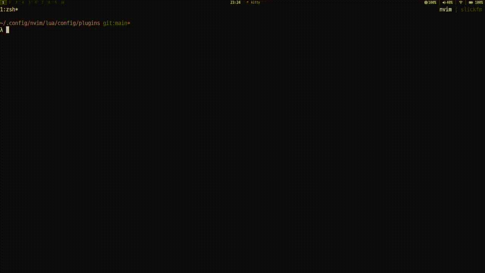

# colorscheme-picker.nvim
A lightweight Neovim plugin for picking, applying, and persisting colorschemes, with optional global style overrides and transparency support.

Designed to stay out of the way and work with your existing setup.

___

## Showcase

[](assets/showcase_video.mp4)

___

### ✨ Features
- Interactive colorscheme picker
    - Supports fzf-lua, telescope or native-find
- Persist last-used colorscheme across restarts
- Optional default colorscheme on startup
- Filter between user-installed and stock colorschemes
- Global style overrides
    - Disable bold, italic, and/or underline across all highlight groups
- Optional background transparency
- Optional highlight customization (CursorLine, Line Numbers, etc.)
- Configurable keymaps
- User commands for scripting and discoverability

___

### 📦 Installation
Using lazy.nvim
``` lua
{
	"danhat1020/colorscheme-picker.nvim",
	dependencies = {
		"ibhagwan/fzf-lua",
        -- or
        -- "nvim-telescope/telescope.nvim"
        -- or
        -- "danhat1020/native-find.nvim"
	},
	config = function()
		require("colorscheme-picker").setup()
	end,
}
```

You must install fzf-lua, telescope.nvim or native-find.nvim.

___

### ⚙️ Setup
**Minimal setup**
``` lua
require("colorscheme-picker").setup()
```

**Default example**
``` lua
require("colorscheme-picker").setup({
	default_scheme = "default", -- can declare scheme or reload last used scheme
	picker = "fzf-lua", -- "fzf-lua" or "telescope"
	include_stock = false, -- include all neovim colorschemes or only installed ones
	colors = {
		transparent = false, -- set background to universally transparent
		cursor_line = nil, -- set cursorline color
		line_number_current = nil, -- set current line number color
		line_number = nil, -- set other line numbers color
		comment = nil, -- set comment color
		inc_search = nil, -- set background of incremental search
		end_of_buffer = nil, -- set ~ color at end of file, set false to remove, or leave as default
		visual_mode = nil, -- set background color of visual mode selection
	},
	style = {
		bold = true, -- universal bold
		italic = true, -- universal italic
		underline = true, -- universal underline
	},
	keymaps = {
		pick = nil, -- open picker
		print = nil, -- print currently used colorscheme
	},
})
```

___

### ⌨️ Commands
The plugin provides the following user commands:

``` lua
:ColorschemePick
```
Open the colorscheme picker.

``` lua
:ColorschemePrint
```
Print the currently active colorscheme.

``` lua
:ColorschemeApply {name}
```
Apply a colorscheme by name (with completion).

___

### 🔑 API
These functions are considered public and stable:

``` lua
require("colorscheme-picker").setup(opts)
require("colorscheme-picker").pick()
require("colorscheme-picker").apply(name)
require("colorscheme-picker").print()
require("colorscheme-picker").get_schemes()
```

Anything else is internal and may change.

___

### 🎨 Transparency
When enabled, the following highlight groups are cleared:

- `Normal`
- `NormalNC`
- `NormalFloat`
- `SignColumn`
- `StatusLine`

If `lualine.nvim` is installed, it will be reloaded automatically.

___

### 🧠 Persistence
This plugin makes use of NeoVim ShaDa to store the last used colorscheme.

Persistence is skipped if a fixed `default_scheme` is configured.

___

### 📋 Notes
- No live preview is performed in the picker (by design).
- Style overrides are applied after loading a colorscheme.
- Only non-stock colorschemes are shown by default.
